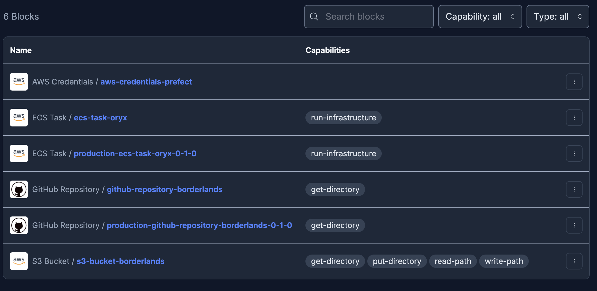

[](https://www.midjourney.com/app/jobs/c2dff0de-6977-4260-9368-95ec2b0752e6/)

# Borderlands


<a href="https://patreon.com/tarrodot" target="_blank"></a>

*ETL for Russo-Ukrainian war data.*

- [Borderlands](#borderlands)
  - [Introduction](#introduction)
  - [Project Structure](#project-structure)
    - [Infrastructure](#infrastructure)
    - [Flows](#flows)
    - [Deployments](#deployments)
    - [Prefect UI](#prefect-ui)
  - [Visually-confirmed equipment losses](#visually-confirmed-equipment-losses)
    - [Access](#access)
    - [Pages](#pages)
  - [References](#references)

## Introduction

This project was started with the objective of making the Oryx's visually-confirmed losses for the Russo-Ukrainian War more accessible for analysis. While I am personally incurring the AWS costs, I greatly appreciate [donations](https://patreon.com/tarrodot?utm_medium=clipboard_copy&utm_source=copyLink&utm_campaign=creatorshare_creator&utm_content=join_link) to help support the maintenance and growth of this project. Borderlands was built such that others may replicate the system privately should they choose to do so.

Access to the data is publicly accessible via AWS CLI. To prevent misuse, the account requesting the data is [pays request and transfer costs](https://docs.aws.amazon.com/console/s3/requesterpaysbucket).

## Project Structure

### Infrastructure

Terraform is used to build the AWS VPC and the assets within it. More can be found in [infrastructure](./infrastructure).

### Flows

Flows are organized into their own libraries within the [`borderlands`](./borderlands) library.

### Deployments

Deployments for production and testing are managed through `manage.py`.

Derived blocks are created from the parent set in the deployment definition. The `-s/--save` argument saves these blocks.

`-a/--apply` applies the deployment.

To create a development deployment

```bash
# Creates a test deployment that pulls code from the branch 'debug'.
# -o outputs the deployment to a yaml.
# --save saves the generated blocks.
python manage.py deploy borderlands.oryx.deployment::oryx_deployment\
  -r debug\
  -o ./test.yaml\
  --save
```

To create a production deployment

```bash
# Creates a production deployment that pulls code from the tag '1.1.3'.
# The generated blocks are saved.
# The deployment is applied.
python manage.py deploy --production\
  -r 1.1.3
  --save
  --apply
```

Development and production follow different naming conventions and build from parent blocks differently.

More can be found in [borderlands/deployer.py](./borderlands/deployer.py).

### Prefect UI

The system will result in a Flow UI like this.


A Blocks UI like this.



## Visually-confirmed equipment losses

The `borderlands.oryx` module is configured to scrape visually-confirmed equipment loss data
from [**Oryx**](https://www.oryxspioenkop.com/), a military analysis blog. You can donate to
the Oryx team at [Patreon](https://www.patreon.com/oryxspioenkop).

### Access

Public permission is limited to reading and listing within the `oryx/media/` and `oryx/landing/` directories.

Media files are organized by image source, while loss records are organized by datetime extracted. For example,

```text
oryx/
  media/
    postimg/
      0009f56c7d0c60eab1538023ffb34111c874cba504c3787419006ac4de1b5e84.jpg
  landing/
    latest.json
    year=2023/
      month=05/
        day=07/
          hour=00/
            oryx_20230507.json
```

These can be accessed via CLI

`aws s3 ls s3://tarro-borderlands/oryx/`

The latest loss records can be accessed via

`aws s3 cp s3://tarro-borderlands/oryx/landing/latest.json .`

### Pages

- [Attack On Europe: Documenting Ukrainian Equipment Losses During The 2022 Russian Invasion Of Ukraine](https://www.oryxspioenkop.com/2022/02/attack-on-europe-documenting-ukrainian.html)
- [Attack On Europe: Documenting Russian Equipment Losses During The 2022 Russian Invasion Of Ukraine](https://www.oryxspioenkop.com/2022/02/attack-on-europe-documenting-equipment.html)

## References

- [ISO Codes](https://www.iso.org/obp/ui/#home)
