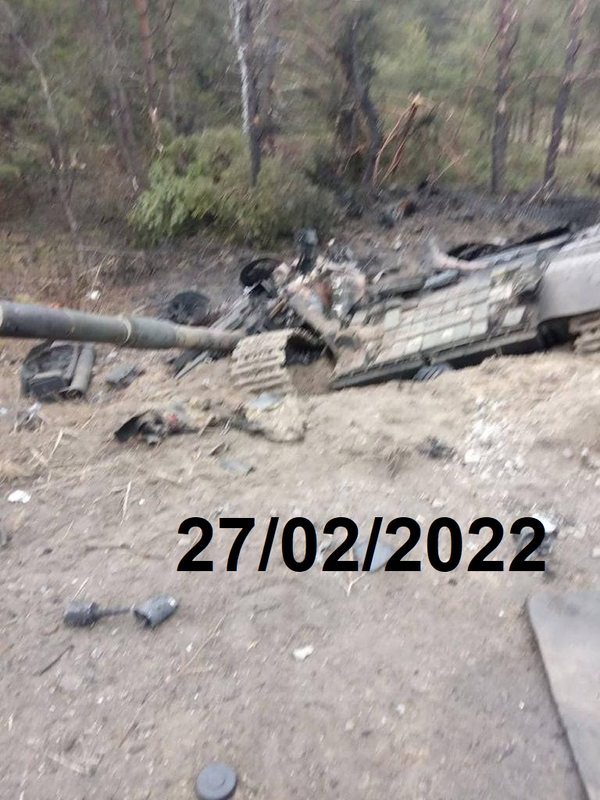

# Media Inventory

!!! warning

    **This dataset is currently private.**

The Media Inventory is a collection of evidence files that were extracted from the [Oryx](./Oryx.md) dataset.

## Sources

- [Postimages](https://postimg.cc/)

## Schema

<!-- BEGIN SCHEMA SECTION -->

| Name            | Type     | Description                     |
|:----------------|:---------|:--------------------------------|
| url_hash        | string   | A SHA-256 hash of the `url`.    |
| url             | string   | The URL to the evidence.        |
| evidence_source | string   | The source of the evidence.     |
| media_key       | string   | The S3 Object Key to the media. |
| file_type       | string   | The file type/extension.        |
| media_type      | string   | The media classification.       |
| as_of_date      | datetime | The date the row was generated. |

<!-- END SCHEMA SECTION -->

## Examples

Evidence is largely composed of JPEGs and PNGs.

| JPEG | PNG |
| --- | --- |
|  |  |
